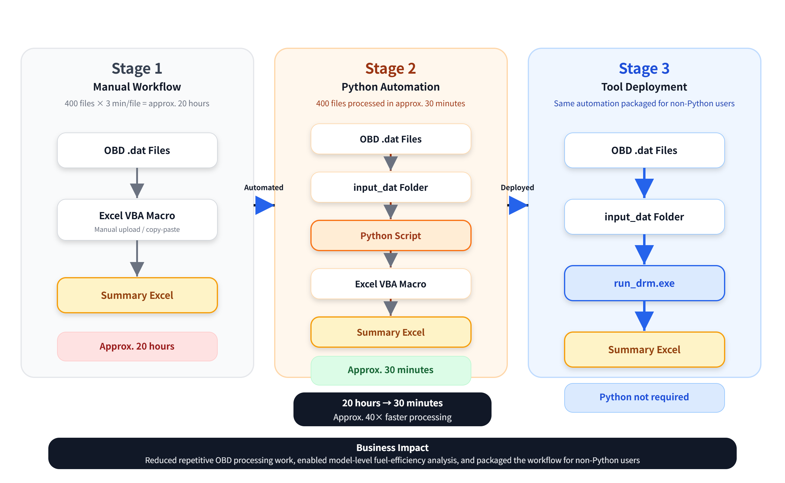
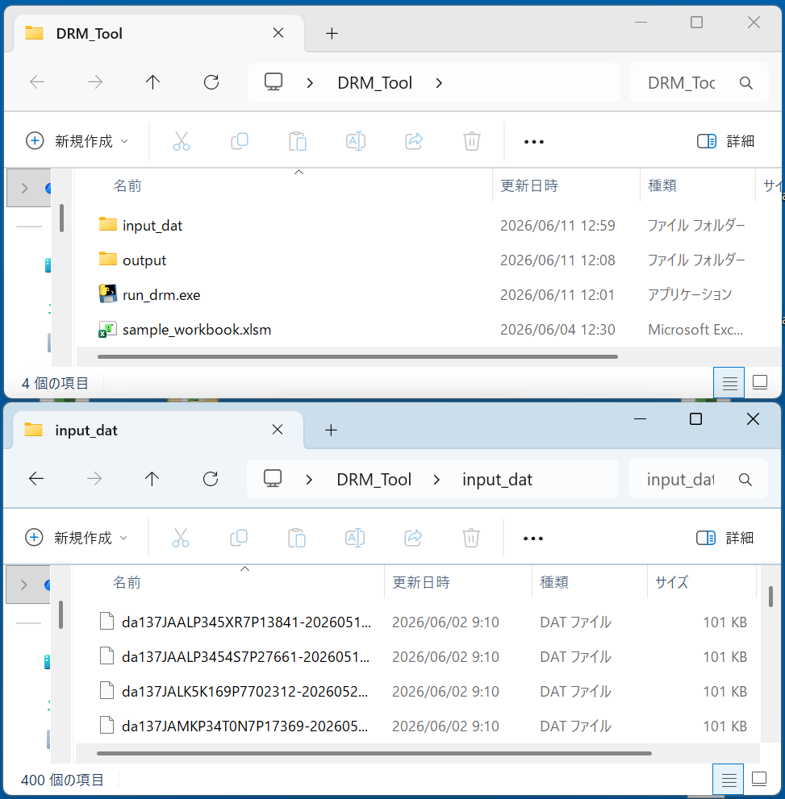
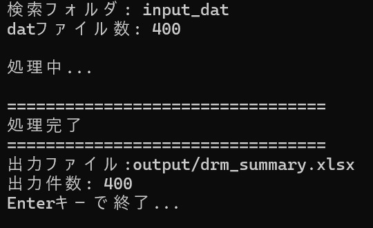
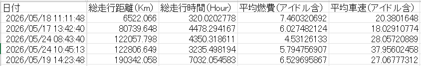

# OBD Telemetry Batch Processing Tool

## Overview

This project automates the processing of vehicle OBD telemetry `.dat` files and transforms a manual Excel VBA workflow into a reusable Windows executable tool.

The solution evolved through three stages:

1. Manual Excel VBA processing
2. Python-based batch automation
3. Windows executable deployment for non-Python users

The final solution reduced the processing time of 400 OBD telemetry files from approximately 20 hours to 30 minutes (40× improvement) and enabled non-Python users to execute the workflow through a standalone Windows executable.

---

## Business Problem

The original workflow required users to:

* Open an Excel VBA workbook
* Upload each OBD `.dat` file manually
* Process files one by one
* Copy and consolidate results manually

When processing hundreds of files, this workflow became time-consuming and error-prone.

---

## Workflow Evolution

### Stage 1 – Manual Workflow

OBD .dat Files

↓

Excel VBA Macro

↓

Summary Excel

**Challenges**

* One file at a time
* Repetitive manual operation
* Difficult to scale

---

### Stage 2 – Python Automation

OBD .dat Files

↓

input_dat Folder

↓

Python Script

↓

Excel VBA Macro

↓

Summary Excel

**Improvements**

* Batch processing of hundreds of files
* Automated data extraction
* Automated summary generation

**Limitation**

* Required Python knowledge to execute

---

### Stage 3 – Tool Deployment

OBD .dat Files

↓

input_dat Folder

↓

run_drm.exe

↓

Summary Excel

**Benefits**

* No Python knowledge required
* Simple deployment to colleagues
* One-click execution
* Reusable business tool

---

## Business Impact

* Automated processing of 400 OBD telemetry files
* Reduced processing time from approximately 20 hours to 30 minutes (40× improvement)
* Eliminated repetitive manual uploads and copy-paste operations
* Generated a consolidated summary report automatically
* Enabled model-level fuel efficiency analysis
* Packaged the workflow as a Windows executable using PyInstaller
* Allowed colleagues without Python knowledge to execute the process

---

## Technologies Used

* Python
* pandas
* openpyxl
* xlwings
* Excel VBA
* PyInstaller

---

## Screenshots

### Workflow Evolution



Evolution from manual VBA processing to Python automation and executable deployment.

---

### Deployment Package



Final deployment package distributed to end users.

---

### Execution Example



Example execution processing 400 OBD telemetry files and generating a consolidated report.

---

### Output Example



Sample output report generated from processed OBD telemetry files. Vehicle identifiers and source file names have been anonymized.

---

## Repository Structure

```text
obd-batch-processing-tool
│
├─ README.md
│
├─ docs
│   ├─ workflow_diagram.html
│   └─ workflow_diagram.png
│
├─ screenshots
│   ├─ deployment_package.png
│   ├─ execution_example.png
│   └─ output_example.png
│
└─ src
    └─ run_drm_sample.py
```

---

## Notes

Actual vehicle data, VIN information, customer information, proprietary Excel VBA files, and production OBD telemetry data are not included in this repository.

File names, vehicle identifiers, workbook names, and screenshots have been anonymized for public sharing.

Sample screenshots and workflow diagrams are provided for demonstration purposes only.
